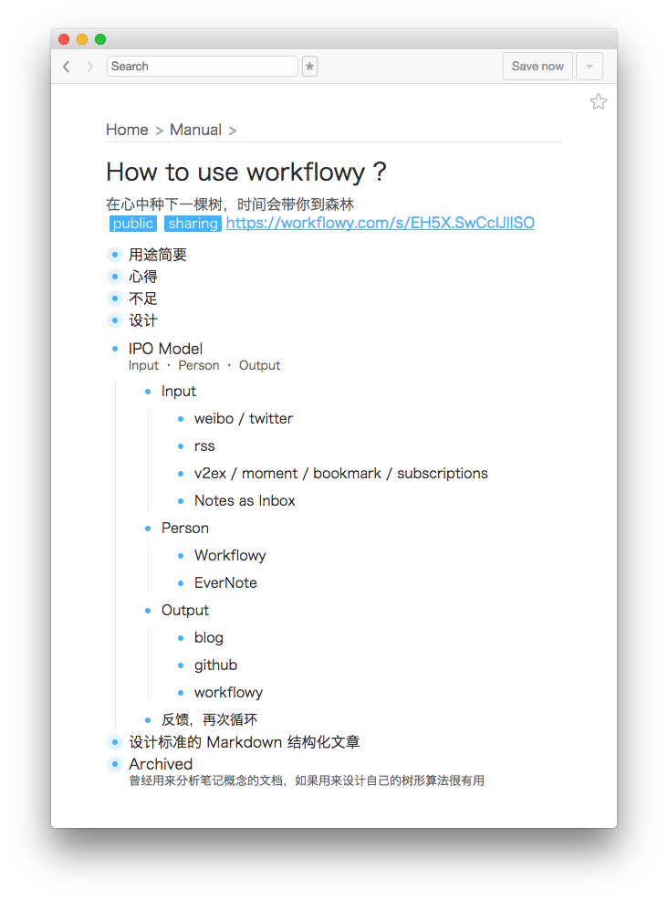
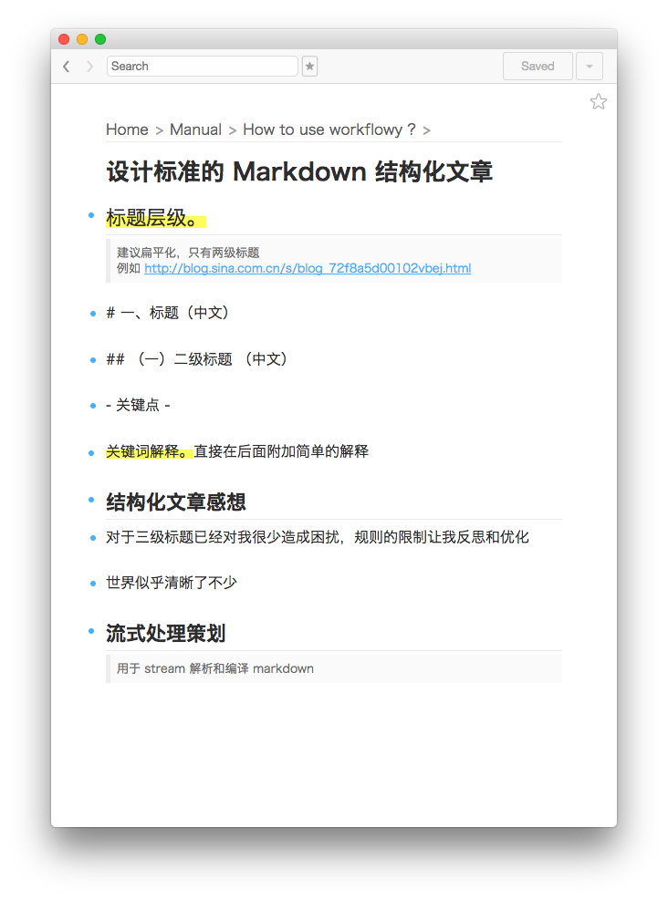

# Workflowy Patch
> Only work macOS now.

Simple Workflowy Layout, theme and add hotkey.

## Install
You **MUST** install Workflowy Chrome version first:

https://chrome.google.com/webstore/detail/workflowy/koegeopamaoljbmhnfjbclbocehhgmkm
```
git clone https://github.com/yantze/workflowy_patch
cd workflowy_patch
./mod.sh
```

Restart Workflowy app


## Theme
- Light
- Markdown

## Add Hotkey
- Go to end of file: <kbd>Ctrl+Shift+G</kbd>
- Change theme: <kbd>Ctrl+Shift+T</kbd>
- Change to Markdown: <kbd>Ctrl+shift+M</kbd>
- Print: <kbd>Ctrl+Shift+P</kbd>
- Copy current Node web url: <kbd>Ctrl+Shift+C</kbd>
- Go Back: <kbd>Ctrl + -</kbd>, <kbd>Command + [</kbd>
- Go Forward: <kbd>Ctrl + +</kbd>, <kbd>Command + ]</kbd>

## Recommand Hotkey (default hotkey)
- Go to end of line: <kbd>Ctrl+e</kbd>
- Next/Before line: <kbd>Ctrl+n/p</kbd>

## Get Title and url from HammerSpoon.app
Put the code to init.lua and reload HammerSpoon
```
-- Type Browser Link
-- Change from https://github.com/ashfinal/awesome-hammerspoon

hs.hotkey.bind({'alt'}, 'v', function()
  local safari_running = hs.application.applicationsForBundleID("com.apple.Safari")
  local chrome_running = hs.application.applicationsForBundleID("com.google.Chrome")
  local stat, data
  if #safari_running > 0 then
    stat, data = hs.applescript('tell application "Safari" to get {URL, name} of current tab of window 1')
  elseif #chrome_running > 0 then
    stat, data = hs.applescript('tell application "Google Chrome" to get {URL, title} of active tab of window 1')
  end

  if stat then
    hs.eventtap.keyStrokes(data[2])
    hs.eventtap.keyStroke({"shift"}, "return")
    hs.eventtap.keyStrokes(data[1])
  end
end)
```

## ScreenShot

### Light



### Markdown



## Tips（中文）
如果要查找 Workflowy 中英文或者数字中的一部分，直接输入是找不到的

比如我搜索 Application，那么 launchApplication 就不会被搜索到，而是要输入`"Application"` 才行
